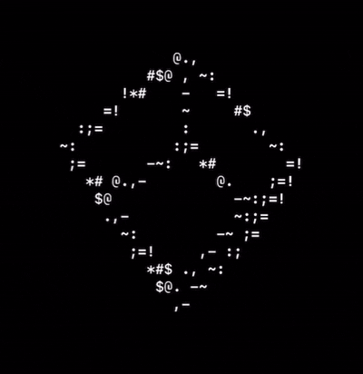

# spinning block
ascii spinning block in lua

------------------

## how to run it:
`git clone https://github.com/burntnut/spinning-block`

`cd spinning-block`

`lua5.3 block.lua`

------------------
## preview:
block.lua:

---------

block_withfaces.lua:

------------------
also this idea was inspired by the spinning c donut

